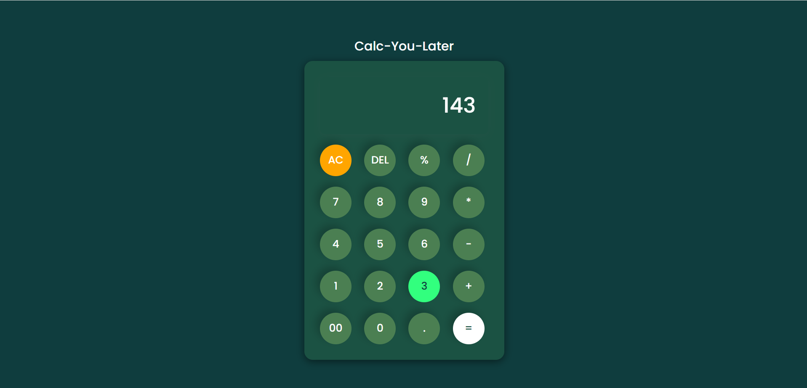

<h1 align="center">🧮 Calc-You-Later</h1>
<p align="center"> Solving problems now so you don’t have to later. 🔢😄</p>

<p align="center">
  
  
  
  
</p>

---

## 🌍 Live Demo

🔗 


---

## 🖥️ Project Overview

**Calc-You-Later** is a stylish and interactive web-based calculator with animations and a green-themed UI. Built using HTML, CSS, and JavaScript, this calculator offers smooth animations, glowing effects, and a responsive design to make basic math fun and engaging.

---

## ✨ Features

- 🧠 Basic arithmetic operations (+, −, ×, ÷, %)
- 🔄 AC & DEL button support
- 💫 Button bounce animation on click
- 🌟 Calculator fade-in effect on page load
- 💡 Display glow pulse on input update
- 📱 Responsive design for all devices
- 🖌️ Green-themed UI with hover transitions

---

## 🛠️ Tech Stack

<p align="center">
  
  
  
</p>

---

## 📸 Screenshots

<div align="center">
  
</div>

---

## 🚀 Getting Started Locally

### 1️⃣ Clone the Repository
```bash
git clone https://github.com/your-username/calc-you-later.git
```
### 2️⃣ Navigate to the Project Folder
```bash
cd calc-you-later
```
### 3️⃣ Open in Browser
Simply open index.html in your preferred browser.

---

## 🙌 Connect with Me
<p align="center"> <a href="https://www.linkedin.com/in/samarth-jaiswal-72b67b313/" target="_blank">  </a> <a href="mailto:samjaiswal51@gmail.com">  </a> </p>

---

## ⚠️ Note
This calculator is a front-end only project meant for learning and demonstration purposes. Feel free to fork and improve it!
